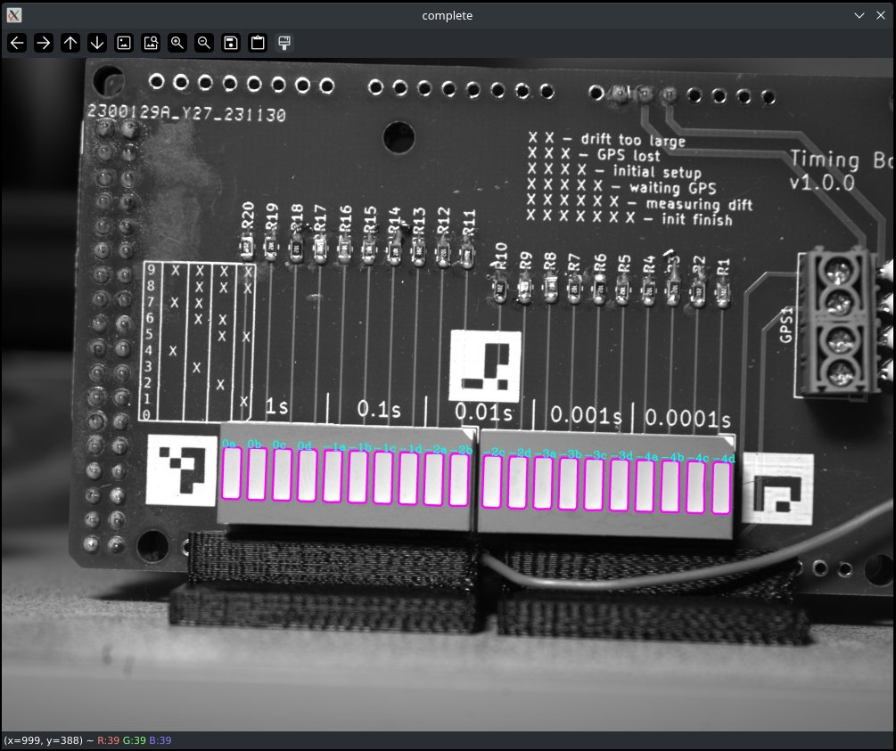
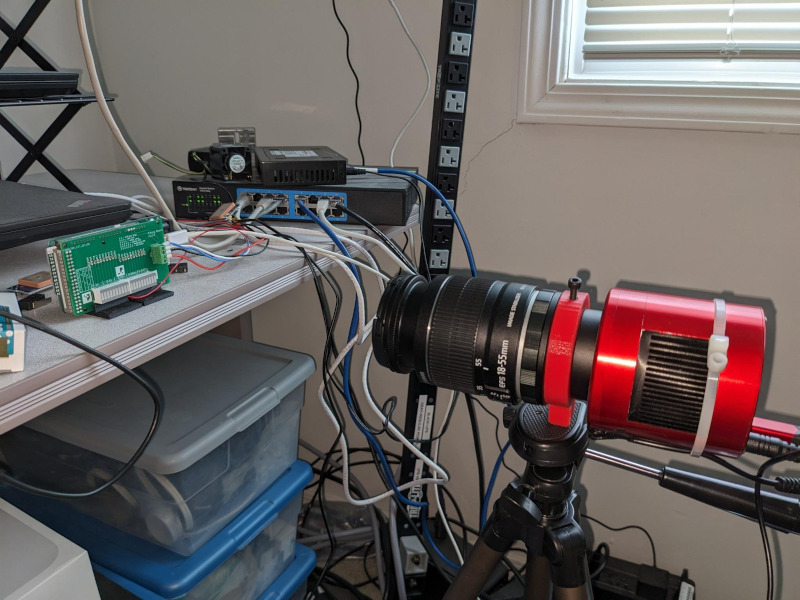

# Exposure Timing

A lot of this project is based off New EXposure Timing Analyser (NEXTA): a GNSS-based precise timer, as presented in the wonderful paper [Reaching sub-millisecond accuracy in stellar
occultations and artificial satellites tracking](https://arxiv.org/abs/2301.06378)[arvix] ([local mirror](./nexta_2301.06378.pdf)) by authors K. Kamiński1 , C. Weber2 , A. Marciniak1 , M. Żołnowski3 & M. Gędek.

The goals are to design electronics and boards to make this easy to use.

 * PCBs that can be easily assembled, and manufactured that allow for easy LED bar registration (By having Aruco markers for example).
   * This should also make it easy to sell kits for people who do not want to solder or hand wire their own.
 * Software:
   * Binaries available for common desktop OS
   * Can automatically finds LED bar
   * Allow manually register LED bar
   * Decode each rows time
   * Generates timing info, real first exposure time, and time for any row (if rolling shutter camera). Recommends offset to be added to header/metadata. 

You should see the following:

# License
Please note that individual files in the repository have different licenses. For example the NEXTA microcontroller code is under CC BY-SA 4.0 and the some of the analysis software is under the GNU GPL 3.

# Brief Description

There can be delays, or accuracy issues between when the camera is told to start it's exposure and when it actually does. This can be important for time critical applications. Also of importance is the time difference for each row in CMOS cameras with a rolling shutter.

In particular the timing application originally of interest is imaging fast time critical astronomical events. Such events include, LEO satilite, astroid transits, fast NEOs.

A better introduction is described in the paper listed above.

## Example usage

* Take your camera with a lens on it
* Put electronics (NEXTA) in front of camera, square well focused.
* Take a intial well lit exposure used for LED bar registartion.
* After NEXTA gets GNSS lock and starts blinking, take short exposures in a dark area.
* Use analysis software to get timing info to see the difference between what is in header/metadata.

# Project contents

* [hardware](./hardware) - This includes 3d printed mount, PCB design files, and arduino firmware
* [nexta_analysis](./nexta_analysis) - Software to try to automatically decode timing images
* [nexta_html_decode_form](./nexta_html_decode_form) - A simple web form to decode the LED pattern into a time.

# Issues

There is a still a lot to do, this project is in it's early stages. Check out the [issue tracker](./issues) and, feel free to contribute.

# Other Projects

If you are interested in this project, you may be also interested in the following.

* [Project Pluto GNSS astrometry](https://www.projectpluto.com/gps_ast.htm) - Take GNSS satelites going across your frame. Since these positions are well known you can use this to get better timing (Probably up to 0.01s)

