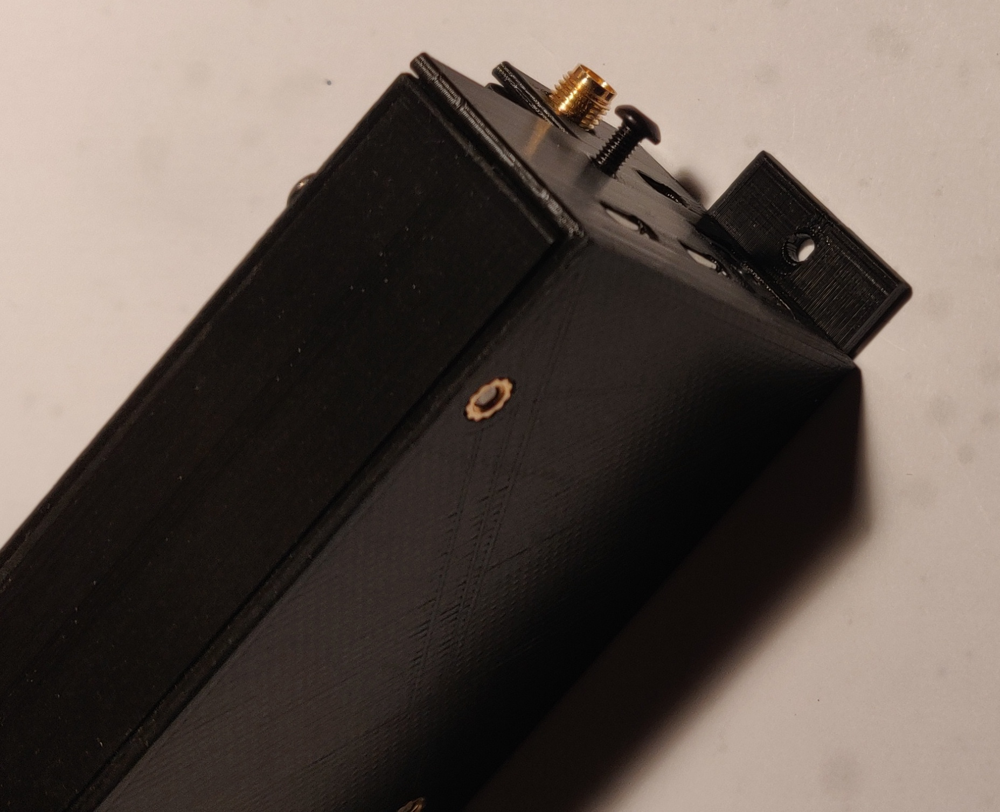

# About
This is a enclosure contributed by Vadim Nikitin, that will contain the timing board, Arduino Due, GPS/GNSS Receiver.

# Parts Needed
## Fasteners
* 6 x Ruthex M3 threaded inserts part # GE-M3x5.7-001 **see NOTE**
* 1 x M3 nut
* M3 button head screws:
  * 1 x 10 mm
  * 1 x 12 mm
  * 2 x 16 mm
  * 1 x 26 mm
  * 2 x 28 mm

**NOTE:** The case can be assembled with M3 nuts instead of inserts using 5 mm longer screws and ignoring the last 10 mm screw altogether. 

## 3D print:
* 1 x [Face](./nexta_box_v6_face.stl)
* 1 x [Lid](./nexta_box_v6_lid.stl)
* 1 x [GPS cover](./nexta_box_v6_gps_cover.stl)
* 3 x [Spacer](./nexta_box_v6_spacer.stl)

[FreeCad File](./nexta_box_v6.FCStd)

# Other
* 100mm of 5 conductor flat cable

# Assembly:
1. Unplug GPS module and Arduino board from timing board.
2. Remove screws and stands attaching face plate to the timing board. They will not be longer used.
3. Solder GPS module to the timing board using flat cable long enough to allow for further assembly (see picture).
  
4. Install Ruthex inserts gently heating them with soldering iron:
  * 3 x into the Lid
    
  * 2 x into GPS cover
    
  * 1 x into Face part on the inside (see picture for location).
    
5. Mount GPS module and cover on the outside of the Face with connector and wires inside (see picture). Screw two M3 x 16 mm screws from the inside through the holes in the Face, GPS module, and into inserts in the GPS cover.
    
6. Place timing board inside Face and faceplate outside. Make sure that flat wire clears mounting stands inside the Face. Faceplate sldes under little recess in the GPS cover. Insert M3 x 12 mm screw into middle hole of the faceplate, through Face and timing board. Fix with M3 nut to the timing board.
   
    
7. Insert two M3 x 28 mm screws through remaining holes in the faceplate and M3 x 26 mm screw into hole in the Face. Slide three 11 mm spacers on the screws inside the Face. Carefully plug in Arduino board into the timing board. Make sure that the screws are centered in the holes of the Arduino board.
   
    
9. Slightly pull back three screws to make ends level with Arduino board. Slide the Lid onto GPS antenna connector. Antenna connector hole in the Lid may need little cleaning to fit the connector. Keep Lid somewhat away from the Face to allow for some clearance for stands in the Lid. Slide Lid all the way. Make sure that all connectors fit into corresponding holes. Close the Lid and screw three screws into inserts in the Lid.
   
9. Screw M3 x 10 mm screw through the hole in the connectors side of the Lid into the insert in the Face.
   
