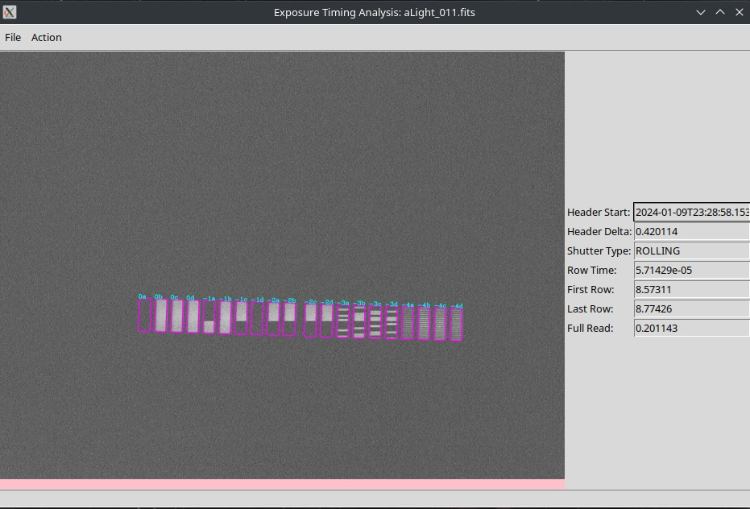

# Exposure Timing - NEXTA Analysis

We try here to automate decode LED patterns into timing information.

You can use single executable binaries, or set up your own python environment to run it.

The current GUI uses tkinter.

# Quick Start

There should be binaries you can download for your desktop operating system so you don't have to set up a python
environment. A single executable that you can run. If you run it without arguments or just double click on it a GUI will
open. You can then load a registration image, register it, load a timing image and read the time. The results show on
the left.


*Header delta is what should be added to the time stamp to make it more accurate.*

If you do have a python environment set up, you can install the dependencies with [poetry](https://python-poetry.org/).

```bash
cd nexta_analysis
poetry install
poetry shell
python read_time_gui.py
```

# Command line

Registration and analysis can be done headlessly with command line arguments. It works with both the built binary or
with python environment.

```shell
./read_time_gui registration -i ./example_files/registration_image.fits -o ./example_files/registration.etreg
```

You can then try to get timing information.

```bash
./read_time_gui readtime -r ./example_files/registration.etreg -o ./example_files/aLight_010.ettime -i ./example_files/aLight_010.fits
```

